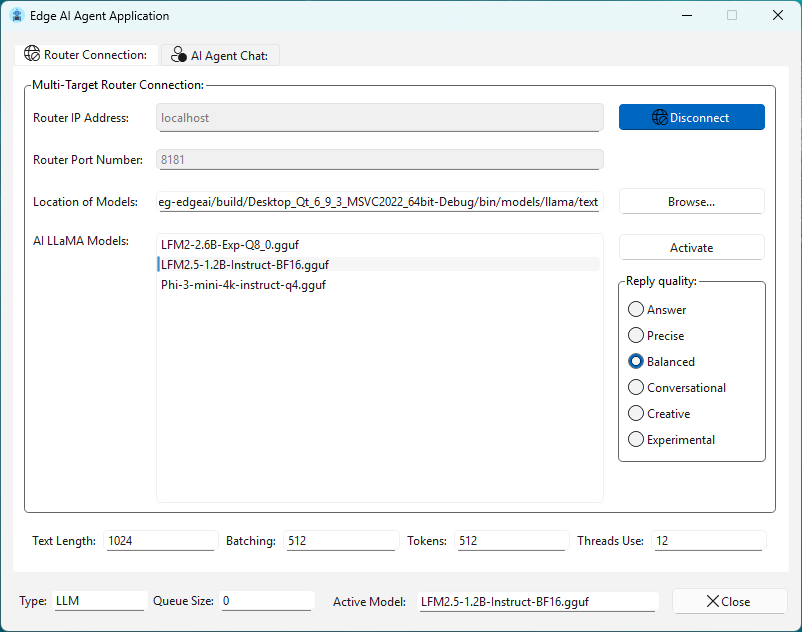
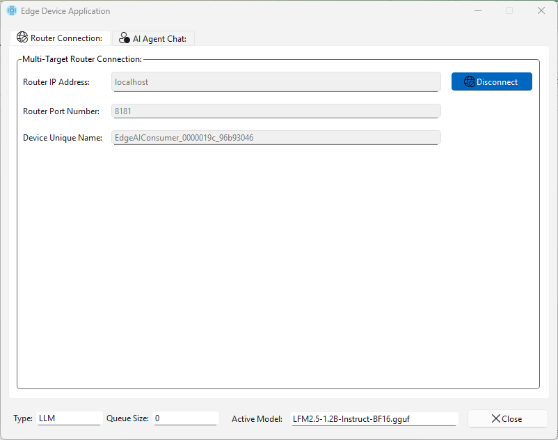

# Areg Edge AI Agent

An Edge AI agent service provider and consumer built on top of the
[Areg SDK](https://github.com/aregtech/areg-sdk) for distributed and event driven systems.

> [!IMPORTANT]
> This repository is under active construction and may not be fully functional yet.
> Follow the repository to receive updates as development progresses.

---

## Why Edge AI on Areg

[Areg SDK](https://github.com/aregtech/areg-sdk) is a framework with tools for building
distributed applications where communication, concurrency, and service lifecycle
are first class concepts. It is designed for systems that require predictability,
clear ownership, and strong runtime observability.

This repository demonstrates how Edge AI agents can be modeled as
Areg services. Each agent acts as a service provider, or a consumer, or both of them,
communicating through well defined interfaces instead of ad hoc message passing.
Areg manages discovery, message routing, threading, and fault isolation,
allowing AI logic to remain focused, testable, and reusable.

A key strength of this approach is observability.
Areg provides structured logging that captures service interactions,
message flow, and per method performance metrics.
These logs can be inspected in real time or offline using
[Lusan](https://github.com/aregtech/areg-sdk-tools),
the official UI toolset for debugging and monitoring Areg based systems.

In practice, this means Edge AI systems built on Areg are transparent,
traceable, and ready for production from the start.

---

## Project Building

Projects in this repository are built with the [**AREG Framework**](https://github.com/aregtech/areg-sdk), [**Qt**](https://www.qt.io/development/download-qt-installer-oss) for UI development, and the [**llama.cpp**](https://github.com/ggml-org/llama.cpp) Edge AI engine. **CMake** is used as the primary build system, and both `areg` and `llama.cpp` are automatically downloaded and built during the build process. Building with **Qt Creator** is recommended, though command-line builds are fully supported if the required Qt packages are installed. 

> [!IMPORTANT]
> To run the applications, you must have AI models compatible with `llama.cpp`. Compatible models are available on [Hugging Face](https://huggingface.co/models); filter by `llama.cpp` and `TextGeneration`. For convenience, place the models in the `./models/llama/text` directory so they are automatically copied to the application working directory during build.

### Requirements

- **C++17 compatible compiler**  
  GCC, Clang, MSVC, or MinGW
- **CMake 3.20 or newer**  
  Required to build applications
- **Java 17 or newer**  
  Required for code generation tools
- **Qt 5.12 or newer**  
  Required for UI based projects
- **Supported Edge AI engine**  
  Currently, only `llama.cpp` is supported.
- **Other tools**  
  For advanced log or service interface visualization, the optional [**Lusan**](https://github.com/aregtech/areg-sdk-tools) tool can be built and used alongside these projects.

### Supported Platforms

- **Operating systems**  
  Linux and Windows
- **Hardware architectures**  
  x86, x86_64, ARM, and AArch64

---

## Planned Use Cases

The following use cases illustrate how Areg can be applied to Edge AI systems.
These cases represent the intended direction of the project.

---

### Use Case 1: One AI Agent Serving Multiple Clients

> [!NOTE]
> **This use case is fully functional and can be tested by running the `aiagent` application as the AI Service Provider and one or more `edgedevice` applications as Service Consumers (device simulations).**

A single AI agent processes text requests from multiple clients connected over a local network. Clients may join or leave at any time. When the AI agent is online, it accepts requests, queues them internally, and returns each response to the correct client without mixing results.

**Key capabilities demonstrated:**
1. **No startup order dependency** -- the AI Service Provider and Service Consumers can start, stop, join, or leave the network at any time without affecting system stability.
2. **Request queuing and isolation** -- all requests are queued on the AI agent side, and each response is routed back to the originating client.
3. **Automatic service discovery** -- when the AI agent becomes available, all connected clients are notified and can immediately start communication.

---

#### Steps to Run the Demo

1. **Build the project**  
   Build using **Qt Creator** or the **CMake command line**. Optionally, build the `lusan` application for log visualization.

2. **Start `mtrouter` (multi-target router)**  
   Run `mtrouter` as a console application or system service on any machine in the network.
   - Ensure the `./config/areg.init` file is present in the working directory.
   - Verify that the router IP address and port are correctly configured using  
     [`router::*::address::tcpip`](https://github.com/aregtech/areg-sdk/blob/master/framework/areg/resources/areg.init#L188) and  
     [`router::*::port::tcpip`](https://github.com/aregtech/areg-sdk/blob/master/framework/areg/resources/areg.init#L189).

3. **(Optional) Start `logcollector`**  
   If you plan to visualize logs in **Lusan**, start `logcollector` as a console application or system service.
   - Ensure `./config/areg.init` is available.
   - Configure the logger IP address and port using  
     [`logger::*::address::tcpip`](https://github.com/aregtech/areg-sdk/blob/master/framework/areg/resources/areg.init#L197) and  
     [`logger::*::port::tcpip`](https://github.com/aregtech/areg-sdk/blob/master/framework/areg/resources/areg.init#L198).

4. **Start `aiagent` (AI Service Provider)**  
   Run `aiagent` on a sufficiently powerful machine.
   - Ensure `./config/areg.init` is present and correctly configured for `mtrouter` (and optionally `logcollector`).
   - The router configuration is automatically loaded from `areg.init` and displayed on the **Router Connection** page. This is a screenshot of already connected and model activated page:
     
   - AI models located in the `./models/llama/text/` folder of working directory are automatically listed.
   - Select a model, choose the desired **Reply Quality**, and optionally adjust parameters such as **Text Length** and **Threads Use**.
   - Click **Connect** to connect to `mtrouter` and activate the model.
   - Models and parameters can be changed at runtime using the **Activate** button.
   - If models are stored elsewhere, use **Browse...** to select a different model directory.
   - Once connected, the application automatically switches to the **AI Agent Chat** page.

5. **Start one or more `edgedevice` instances (Service Consumers)**  
   Run `edgedevice` on one or more less powerful machines.
   - Ensure each instance has its own `./config/areg.init` file with correct `mtrouter` (and optional `logcollector`) settings.
   - The router configuration is automatically displayed on the **Router Connection** page. This is a screenshot of already connected and model activated page:
     
   - Click **Connect** to join the network.
   - Once connected, the application automatically switches to the **AI Agent Chat** page.

**Example:** Multiple `edgedevice` instances communicating simultaneously with a single `aiagent`:

> [!TIP]
> `mtrouter`, `logcollector`, `aiagent`, and `edgedevice` can be started in **any order**. Services are discovered automatically as they become available. Multiple requests can be sent without waiting for previous responses, each `edgedevice` instance and each request receives its own independent reply from the AI agent.

---

### Case 2: Multiple AI agents managed by a central service

**This use case is part of the current implementation.**

A central service provider receives requests from many clients.
For each request, the provider starts a dedicated thread or process
hosting an AI engine instance.
Processing runs in parallel and results are returned to the provider,
which forwards them to the originating clients.

**Key features to demonstrate:**
1. No startup order is required. Service Provider and Service Consumers join or leave the network freely.
2. Requests are not queued. Each request immediately triggers a new thread or process with its own AI engine instance. When processing is complete, the central provider sends the response to the requester.
3. Automatic service discovery with the same behavior as in Case 1.
4. The system can instantiate many independent AI engine instances.

---

### Case 3: Dynamic AI skill marketplace

Each small Edge AI agent service represents a specific skill:
- One skill rewrites text.
- Another compresses it.
- Another expands it.
- Another evaluates or rates it.

Clients publish a goal such as generating a short description
with a score above a given threshold.
Any available skill that matches the requirement may claim the task.
The system behaves like a decentralized marketplace of capabilities.

**Key features to demonstrate:**
1. Auto-discovery of services with specific capabilities.
2. Decentralized task assignment with no single point of failure.
3. Multi-role behavior: any node may be both consumer and provider.
4. Runtime expansion: new skills can appear and work instantly.

---

### Case 4: Scenario simulation with AI agents as characters

A virtual story world is created where each agent represents a character
with a defined personality.
A central controller introduces scenarios such as investigating a mystery,
planning a project, or debating a topic.
Agents exchange messages according to predefined rules and react to each
other's outputs.

**Key features to demonstrate:**
1. Many independent agents interacting in a shared context.
2. State synchronization through AREG events.
3. Multi-room or multi-scenario orchestration.
4. Dynamic participation: new characters can join or leave at any time.

---

### Case 5: Multi stage distributed evaluator

A quality evaluation pipeline is composed of multiple evaluator agents:
- One evaluates clarity.
- Another evaluates style.
- Another checks consistency.
- Another evaluates creativity.

A coordinator aggregates the individual scores and produces a final rating.

**Key features to demonstrate:**
1. Many small services contributing to a single final result.
2. Parallel evaluations.
3. Redundant evaluators: start three clarity evaluators and one is chosen automatically.
4. Service discovery and role specialization.

---

### Case 6: Hierarchical and cross connected agents

A central register application monitors and coordinates multiple agent applications.
Each agent hosts its own AI engine and has a unique name.
Agents and the register may run on the same machine or on different machines.

The register can create discussion rooms by selecting multiple agents
and providing a topic.
Each agent generates an initial response.
All participants receive the initial texts and continue a shared discussion.
Multiple discussion rooms may exist at the same time,
and agents may participate in more than one room concurrently.

**Key features to demonstrate:**
1. Many AI agent services can run in the network at the same time.
2. Every agent can act as both service provider and service consumer.
3. Mesh style communication. Even if the register application shuts down, existing discussion rooms continue to function. Texts do not leak between rooms and each topic remains isolated.
4. Fault tolerance. Any agent or the register can disconnect and reconnect without interrupting ongoing communication among other agents.
5. Horizontal and vertical use. Agents can consume each other's services or provide services to each other without restrictions.

> [!NOTE]
> **These use cases are planned and may change over time.**
> **Some may be combined, refined, or replaced as development progresses.**
> **Feedback and feature requests are welcome.**

---

## Call to Action

This project is at an early stage and actively looking for contributors.

If you are interested in Edge AI, distributed systems, service oriented architecture,
or C and C++ development, consider joining the effort.
Contributions are welcome in code, testing, documentation, integration,
or design discussions. Do not hesitate to open issues, suggest features.

Do not forget to star this and [`areg-sdk`](https://github.com/aregtech/areg-sdk) repositories to show your support.

---

## License

This project is licensed under the MIT License.
See the [LICENSE](LICENSE) file for details.
